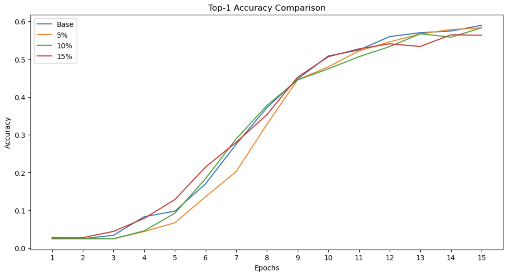
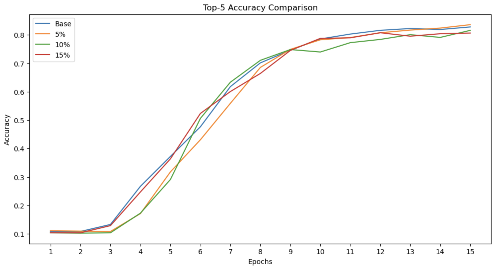

# Video Outlier Optimization

## [Paper](https://openreview.net/forum?id=05KyVpROQB)
## [Website](https://video-outlier-optimization-web.onrender.com/)

## Abstract

Training sample quality impacts on deep learning model performances. While studies in the literature explored the association of outlier samples to model performance in modalities like text or images in the NLP and computer vision domains, it is relatively underexplored in the domain of video classifications. Researchers focused on anomaly detection or theoretical bounding of outliers towards video classifications. However, explicit, systematic empirical studies of the impacts of these outliers on video classification modeling are still yet to be explored. Therefore, to bridge this gap, in this work, we systematically analyze the impacts of outliers, specifically in-distribution outliers, on video classification performances and show that reducing the outliers from training can improve video classification performances.

## Results
### Top-1 Accuracy

### Top-5 Accuracy


## Setup and Training

`$ git clone https://github.com/ckeith26/video-outlier-optimization.git`

or if you have ssh

`$ git clone git@github.com:ckeith26/video-outlier-optimization.git`

### Jupyter Notebooks [Independent Model Training](./training_files/)

You can train any of the models directly from the Jupyter notebooks. The trained models will be saved in the [models](./models/) directory.

#### Download Datasets

1. Download the [UCF101 dataset](https://www.crcv.ucf.edu/datasets/human-actions/ucf101/UCF101.rar) and extract the files to `./data/UCF-101`.
2. Download the [UCF101 TrainTestlist](https://www.crcv.ucf.edu/wp-content/uploads/2019/03/UCF101TrainTestSplits-RecognitionTask.zip) and extract the files to `.data/ucfTrainTestlist`.

#### Conda Environment
If you don't have a conda env setup already:

`$ conda create -n myenv python=3.8`
`$ conda install transformers tqdm torchvision torch numpy pandas seaborn av ipykernel`

### Pipeline [Model Training with Pipeline](./scripts/setup.py)

1. Download Docker: `$ pip install docker`
2. Run `$ sh ./scripts/run.sh` to build the Docker image and run the container.

**Or** manually run the following commands:
2. Build the Docker image: `$ docker build -t video_outlier_optimization -f ./container/Dockerfile .`
3. Run the Docker image: `$ docker run -p 8888:8888 video_outlier_optimization`

Troubleshooting: [Docker docs](https://docs.docker.com/get-docker/)

## Model Modification

### Training Parameters
- train_test_size: Number of training samples to use (e.g., 100k).
- train_test_split: The proportion of the dataset to include in the train split (e.g., 0.8).
- epochs: for training all models (e.g., 15).

### Data Parameters
- load_more_data: if True, the code will load a new dataset with the specified train_size.

### Configuration File 

[Modify config.ini](config.ini)

This code reads configuration values from an INI file named `config.ini` located in the parent directory (`./config.ini`). The configuration file should have the following structure:

```ini
[models]
model1 = ./training_files/base_model.ipynb
model2 = ./training_files/outlier_model_5P.ipynb
model3 = ./training_files/outlier_model_5P.ipynb
model4 = ./training_files/outlier_model_5P.ipynb

[training]
train_size = 100000
train_test_split = 0.8
epochs = 15
batch_size = 128

[data]
load_more_data = False
train_dataset = ./data/train_data.pt
test_dataset = ./data/test_data.pt
train_subset_100k = ./data/train_subset_100k.pt
test_subset_20k = ./data/test_subset_20k.pt
train_subset_100k_rest = ./data/train_subset_100k_rest.pt
test_subset_20k_rest = ./data/test_subset_20k_rest.pt
```
